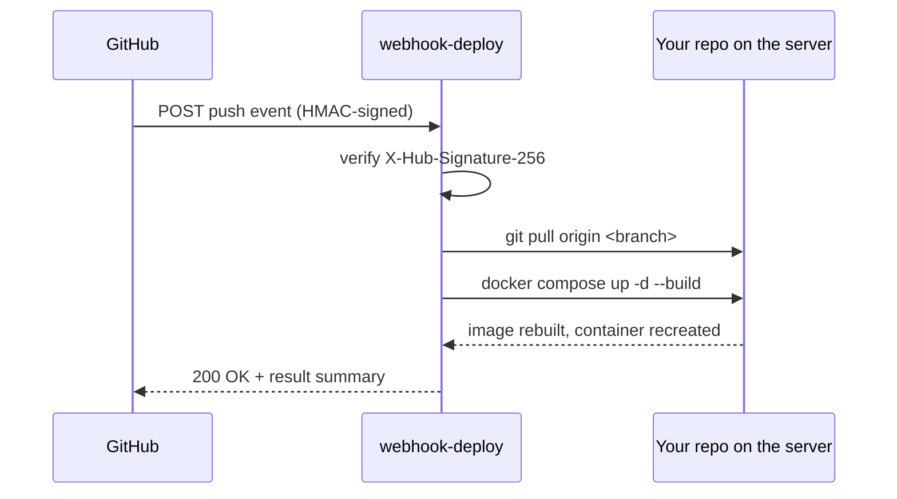

# webhook-deploy

**Push to GitHub. Your Docker Compose stack rebuilds itself.**


A tiny self-hosted server that turns `git push` into a deploy. It listens for
GitHub push webhooks, verifies the HMAC signature, runs `git pull`, then
`docker compose up -d --build` so your containers rebuild from the new source.

No registry. No CI pipeline. No agent to trust. **One dependency-free Python
file (~170 lines) you can read end to end in two minutes.** One server can
deploy many repos.

```
git push  →  GitHub webhook  →  git pull  →  docker compose up -d --build
```

## Why webhook-deploy?

If you run Docker Compose apps on a VPS and just want them to update when you
push, the usual options are heavier than the problem:

|                          | **webhook-deploy**          | Watchtower                | adnanh/webhook       | Coolify / Dokku / CapRover |
| ------------------------ | --------------------------- | ------------------------- | -------------------- | -------------------------- |
| Deploys from             | **source** (`pull` + build) | prebuilt registry images  | runs any command     | source / buildpacks        |
| Needs a registry or CI?  | **No**                      | Yes (you build & push)    | —                    | Built-in builder           |
| Footprint                | **1 file, 0 deps**          | a container               | a Go binary          | a full platform + DB       |
| Config                   | **one JSON file**           | labels / env              | hook DSL             | web UI                      |
| Audit time               | **~2 minutes**              | —                         | —                    | —                          |

- **vs Watchtower** — Watchtower watches a registry and pulls updated *images*,
  so you still need something to build and push them. webhook-deploy rebuilds
  from *source* on the box, so there's no image pipeline at all.
- **vs a generic webhook runner** — webhook-deploy is purpose-built for the
  pull-and-rebuild flow: signature verification, per-repo branch gating, and
  multi-repo routing are already done, not assembled from a config DSL.
- **vs a PaaS** — no UI, no database, no buildpacks, no lock-in. You keep your
  existing `docker-compose.yml`; this just re-runs it on push.

## How it works



Because your services build from a `Dockerfile`, `--build` produces a fresh
image, which recreates the container, which re-runs its startup command (your
migrations, your new server). A push to a non-configured branch is ignored.

The server binds to `127.0.0.1` only, so it's never exposed directly. Put it
behind a [Cloudflare Tunnel](https://developers.cloudflare.com/cloudflare-one/connections/connect-networks/)
or a reverse proxy. With a tunnel you don't even open an inbound port.

## Requirements

- Python 3.9+ (standard library only — nothing to `pip install`)
- `git`
- Docker with Compose v2 (`docker compose`, not the legacy `docker-compose`)

## Quickstart

### 1. Clone to your server

```bash
git clone https://github.com/MurkyPuma/webhook-deploy.git /prod/webhook-deploy
cd /prod/webhook-deploy
```

### 2. Configure your repos

Copy the template and fill it in. The real `config.json` is gitignored, so your
secret never gets committed:

```bash
cp config.example.json config.json
```

```json
{
  "secret": "a-long-random-string",
  "port": 9000,
  "repos": {
    "your-username/your-repo": {
      "path": "/prod/your-repo",
      "branch": "main"
    }
  }
}
```

Generate a strong secret with `openssl rand -hex 32`. Clone each repo you want
to deploy to its `path` on the server.

### 3. Run it as a service

```bash
sudo cp webhook.service /etc/systemd/system/
# edit User= and the paths in the unit file to match your setup
sudo systemctl daemon-reload
sudo systemctl enable --now webhook
```

Or just run it directly to try it out: `python3 webhook.py`.

### 4. Expose it (Cloudflare Tunnel)

Point a hostname at the loopback port — no inbound port required:

```
hostname: webhook.yourdomain.com
service:  http://127.0.0.1:9000
```

### 5. Add the webhook on GitHub

For each repo: **Settings → Webhooks → Add webhook**

- **Payload URL:** `https://webhook.yourdomain.com`
- **Content type:** `application/json`
- **Secret:** the same value as `config.json`
- **Events:** Just the `push` event

Push to that repo and watch it deploy.

## Configuration reference

Each entry under `repos` is keyed by the GitHub `owner/name` and accepts:

| Field          | Required | Default  | Description                                                        |
| -------------- | -------- | -------- | ------------------------------------------------------------------ |
| `path`         | yes      | —        | Absolute path to the repo checkout on the server.                  |
| `branch`       | no       | `main`   | Only pushes to this branch trigger a deploy.                       |
| `compose_dir`  | no       | repo root | Run compose from this subdirectory of the repo.                    |
| `compose_file` | no       | default  | Use a non-default compose file (e.g. `docker-compose.prod.yml`).   |

Top-level keys: `secret` (your webhook secret), `port` (default `9000`), and
`repos`.

## Operating

```bash
# follow the logs
sudo journalctl -u webhook -f

# health check
curl https://webhook.yourdomain.com        # -> "webhook server running"
```

GitHub's webhook page shows every delivery and its response body (the deploy
result summary), which is the fastest way to debug a failed deploy.

## Security notes

- Every request must carry a valid `X-Hub-Signature-256` HMAC over the raw body;
  unsigned or mismatched requests get a `403`. Comparison is constant-time.
- The server listens on loopback only — keep it that way and front it with a
  tunnel or proxy that terminates TLS.
- Treat `secret` like a password. It lives only in your gitignored `config.json`.
- The deploy runs `git pull` and `docker compose` as whatever user the service
  runs as, so that user needs Docker access and write access to the repo paths.

## FAQ

**Does it work for non-Docker apps?** Not as-is — it always runs
`docker compose up -d --build`. Swap that command in `deploy()` for whatever
restarts your app (it's a few lines).

**What about private repos?** Fine — the server pulls over whatever git
credentials its checkout already uses (deploy key or token in the remote URL).

**Multiple services on one host?** Yes. Add one entry per repo to `config.json`
and one webhook per repo on GitHub, all sharing the same secret.

**Does it roll back on failure?** No. A failed build leaves the previous
containers running (compose only recreates on a successful build) and returns
the error in the webhook response. Keep it simple; check the delivery log.

## License

MIT — see [LICENSE](LICENSE).
